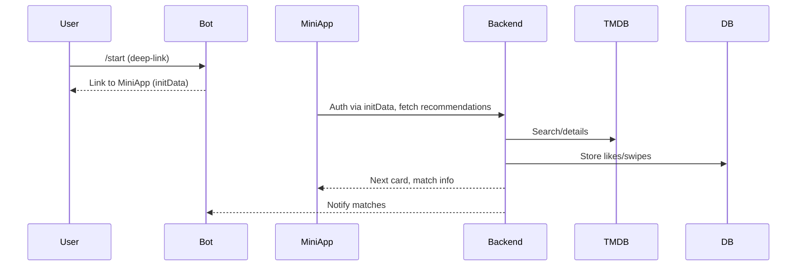

# Kino Bot — overview

Components:

- Aiogram bot: onboarding, reminders, notifications.
- Mini App: swipe UI, history, match view.
- Backend (FastAPI): TMDB proxy, auth, persistence (Postgres), rate limits, cache.
